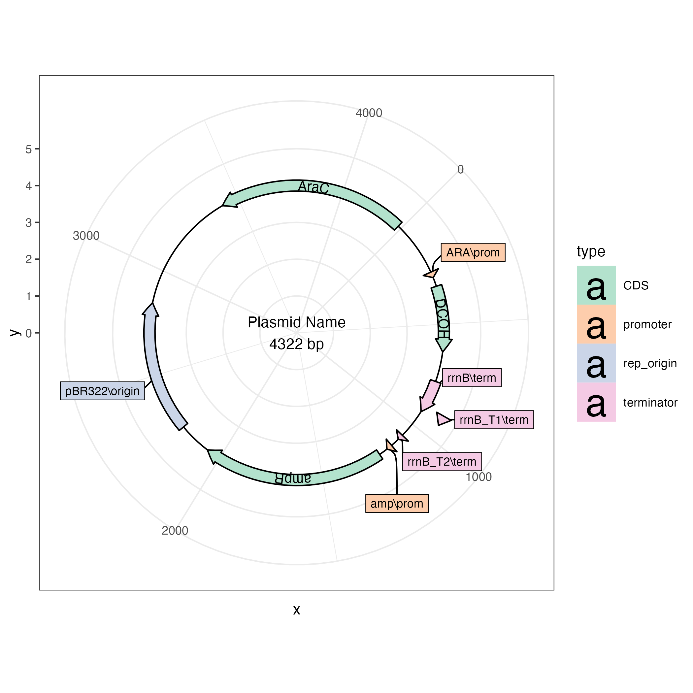

# plasmapR

This is an R package for making plasmid maps using `{ggplot2}`.

## Installation

> This package is still very early in development and the API may
> change. The parser for `.gb` files works most of the time but has not
> been tested extensively.

``` r
# install.packages("devtools")
devtools::install_github("bradyajohnston/plasmapr")
```

## Example

`plasmapR` provides functions for parsing and plotting .gb plasmid
files.

Once a plasmid has been exported in Genbank format it can be parsed and
plotted.

``` r
library(plasmapR)

fl <- system.file('extdata', 'petm20.gb', package = "plasmapR")

fl |> 
  read_gb() |> 
  plot_plasmid(name = "pETM-20")
```

<!-- -->

Access the features by turning the plasmid into a data.frame.

``` r
fl |> 
  read_gb() |> 
  as.data.frame()
```

    ##    index                    name         type start  end direction
    ## 1      1 synthetic DNA construct       source     1 7700         1
    ## 2      2                 f1 orim   rep_origin    12  467         1
    ## 3      3           AmpR promoter     promoter   494  598         1
    ## 4      4                    AmpR          CDS   599 1459         1
    ## 5      5                     ori   rep_origin  1630 2218         1
    ## 6      6                     bom misc_feature  2404 2546         1
    ## 7      7                     rop          CDS  2648 2839        -1
    ## 8      8                    lacI          CDS  3648 4730         1
    ## 9      9           lacI promoter     promoter  4731 4808         1
    ## 10    10             T7 promoter     promoter  5121 5139         1
    ## 11    11            lac operator protein_bind  5140 5164         1
    ## 12    12                    TrxA          CDS  5209 5535         1
    ## 13    13                   6xHis          CDS  5557 5574         1
    ## 14    14         AviTag Insert R  primer_bind  5578 5628        -1
    ## 15    15                TEV Site          CDS  5584 5604         1
    ## 16    16              AviTag(TM)          CDS  5611 5655         1
    ## 17    17         AviTag Insert F  primer_bind  5629 5673         1
    ## 18    18             dsnPPR10-C2          CDS  5659 7503         1
    ## 19    19                   6xHis          CDS  7544 7561         1
    ## 20    20           T7 terminator   terminator  7628 7675         1

## A {ggplot2} Object

The result of the call is just a {ggplot2} plot, which you can further
customise to your liking with themes, etc.

``` r
fl <- system.file('extdata', '20.gb', package = "plasmapR")

plt <- fl |> 
  read_gb() |> 
  plot_plasmid()

plt + ggplot2::theme_bw()
```

<!-- -->
