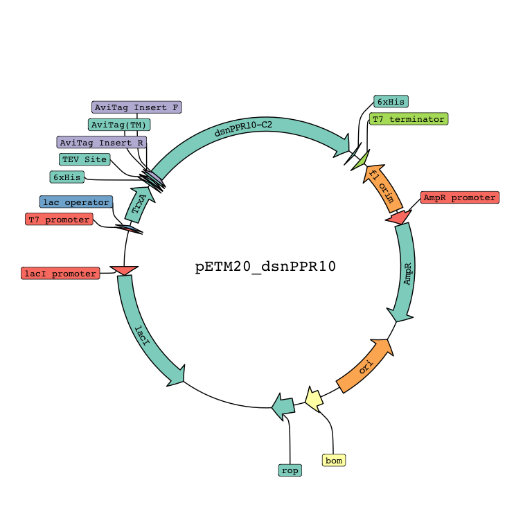

plasmapR
================
Brady Johnston

## About

Extension on the {ggplot2} graphics library for generating quick plasmid
maps from FASTA / genbank files.

Example below:

``` r
#devtools::install_github("bradyajohnston/plasmapR")
library(plasmapR)

plasmid <- parse_plasmid("data/petm20.gb")

p <-
  render_plasmap(
    plasmid,
    rotation = 45,
    plasmid_name = "pETM20_dsnPPR10"
    
  )
p
```


## Just a `ggplot`

The result of the `render_plasmap()` function is just a `ggplot` object.
You can then customise aspects of it as much as you would like, such as
the colour scheme.

``` r
p + ggplot2::scale_fill_brewer(palette = 8, 
                               type = "qual")
```


