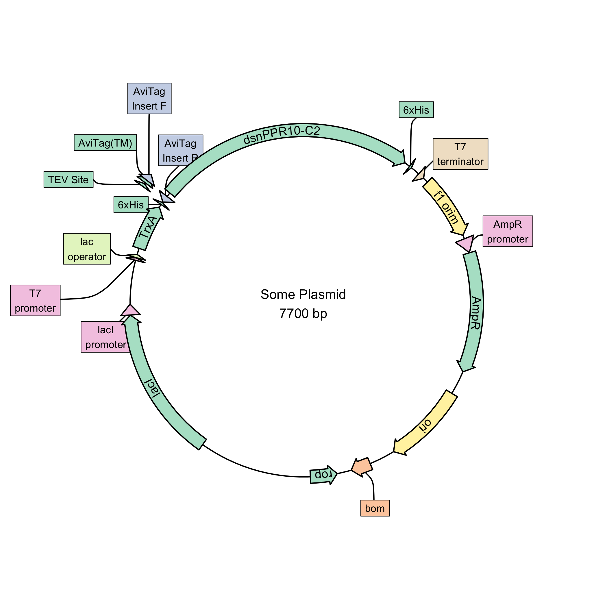

# plasmapR

This is an R package for making plasmid maps using `{ggplot2}`.

## Installation

> This package is still very early in development and the API may
> change. The parser for `.gb` files works most of the time but has not
> been tested extensively.

``` r
# install.packages("devtools")
devtools::install_github("bradyajohnston/plasmapr")
```

## Example

`plasmapR` provides functions for parsing and plotting .gb plasmid
files.

Once a plasmid has been exported in Genbank format it can be parsed and
plotted.

``` r
library(plasmapR)

plasmid <- read_gb("data/petm20.gb")

p <- plot_plasmid(plasmid)
```

    ## Warning in stat_arrow(colour = "black", bp = bp, arrowhead_size = 1): Ignoring
    ## unknown parameters: `middle`

``` r
p
```

<!-- -->
