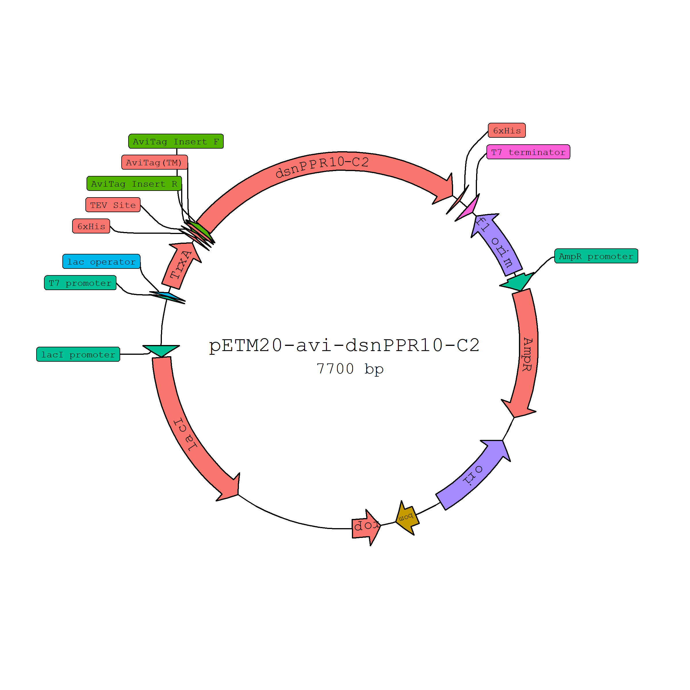
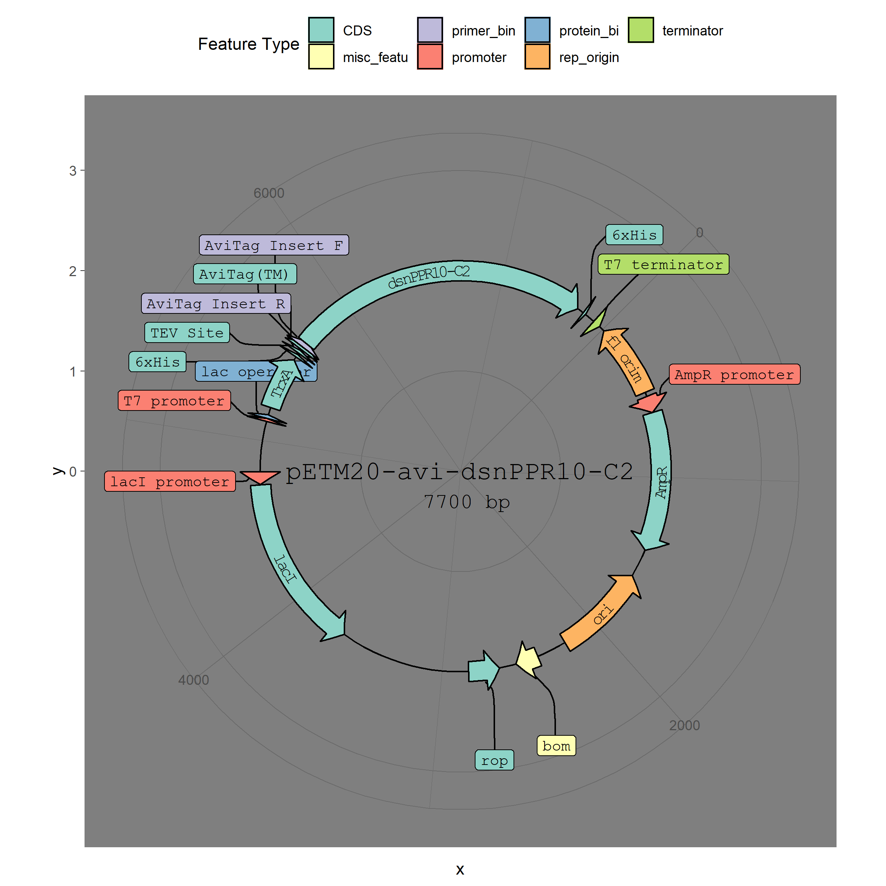
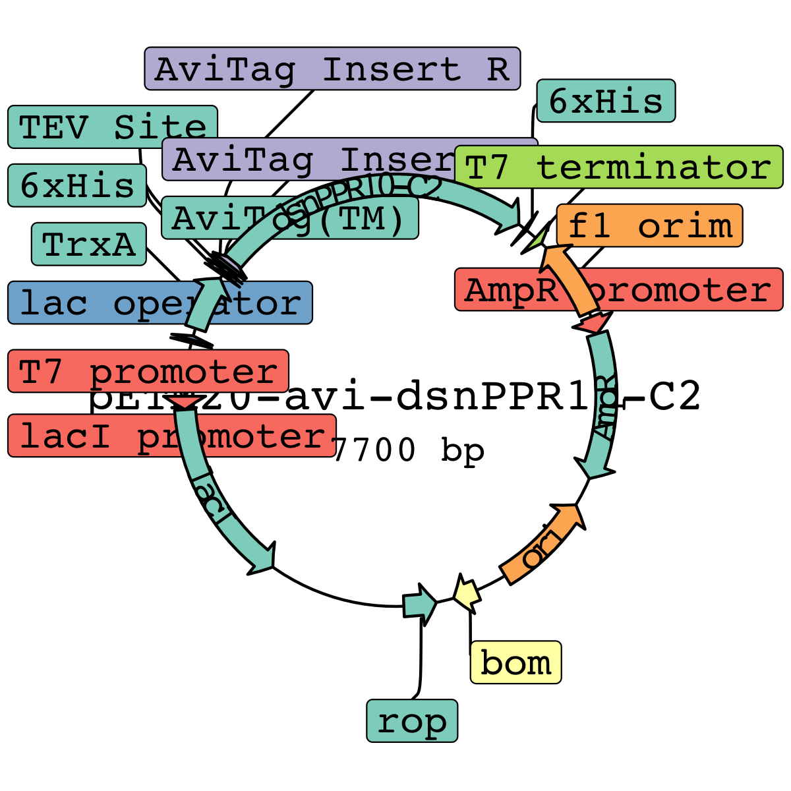
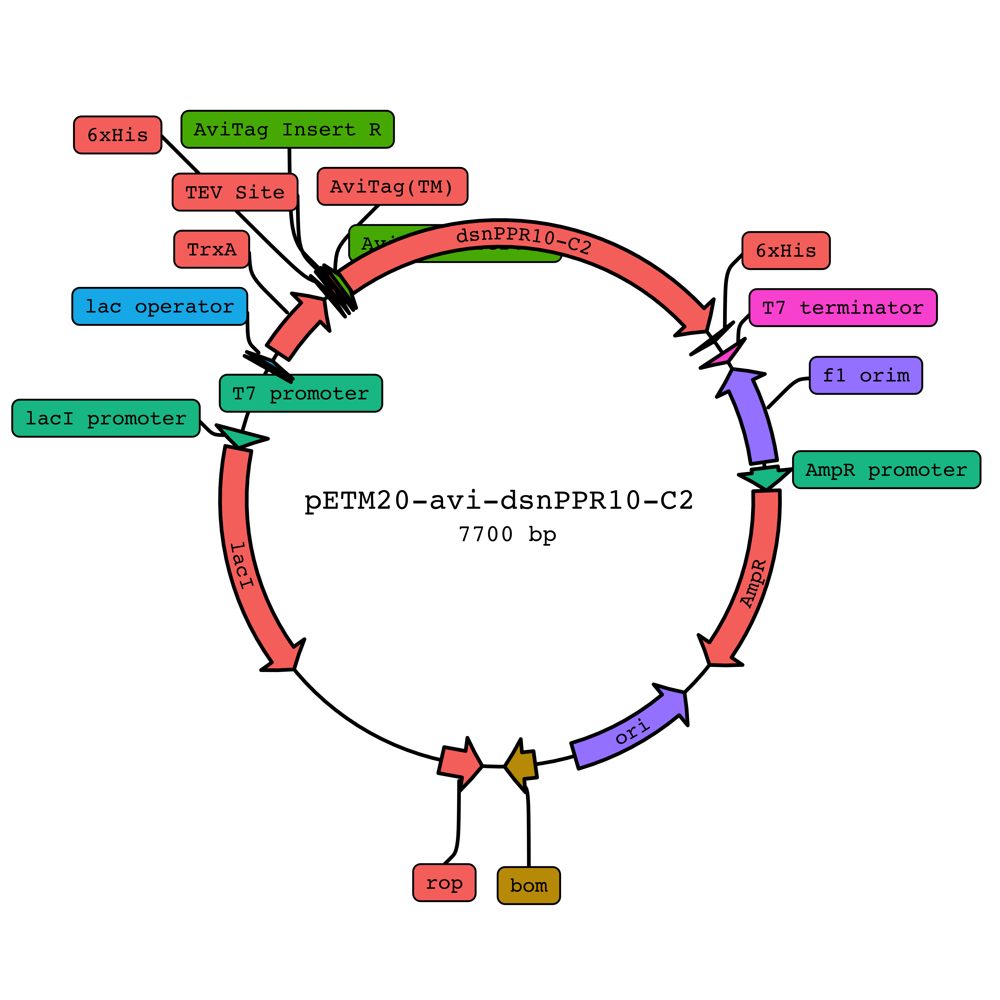

# plasmapR

This is an R package for making plasmid maps using `{ggplot2}`.

## Installation

> This package is still very early in development and the API may
> change. The parser for `.gb` files works most of the time but has not
> been tested extensively.

``` r
# install.packages("devtools")
devtools::install_github("bradyajohnston/plasmapr")
```

This package utilises the fantastic functions from a number of other packages to quickly
create beautiful `ggplot` figures from Genbank files to render plasmids.

THe pacakges doing most of the heavy lifting are: 

 - ggplot2
 - ggrepel
 - ggfittext

## Example

`plasmapR` provides functions for parsing and plotting .gb plasmid
files.

Once a plasmid has been exported in Genbank format it can be parsed and
plotted.

``` r
#devtools::install_github("bradyajohnston/plasmapR")
library(plasmapR)

plasmid <- parse_plasmid("data/petm20.gb")

p <- render_plasmap(plasmid,
                    rotation = 45,
                    plasmid_name = "pETM20-avi-dsnPPR10-C2", 
                    curved_scaling = 1.2)

p
```



## Under the Hood

The result of the `render_plasmid()` function is just a `ggplot` object,
so you can add themes and treat it as you would any other `ggplot`
object.

``` r
p <- p + ggplot2::scale_fill_brewer(palette = 8, type = "qual")

p
```

<!-- -->

Coordinates have been transformed with `coord_polar()` but everything
else remains the same.

``` r
p + 
  ggplot2::theme_dark() + 
  ggplot2::theme(legend.position = "top")
```



## Major Limitations

Currently the method for curving the text results in the problem of
resizing. The individual characters are spaced based on the underlying
base pair counts, not plot coordinates. If you scale the plot, things
start to break down pretty quickly.

I’m working on an fix that will allow resizing and scaling of the whole
plot, but currently defaults are set up for a plot width and height of 8
inches each.

``` r
knitr::opts_chunk$set(fig.width = 4, fig.height = 4)
```

``` r
p
```



### Scale it back

To overcome this, you must manually specify a scaling factor to reduce
the size and width of the text (which will scale proportionally).

Currently the scaling factors are curved\_scaling (which scales the size
of the text and also the scale between the letters) and size\_scale
which additionally scales the distance between the letters.

Currently it’s a bad system where for a smaller image, the actual arrow
is smaller and thus the distance between each individual plotted letter
needs to be increased.

I haven’t figured out the way to do that well yet - so currently they
are both just hacky parameters to fiddle with.

Will return to in the morning when I am less tired.

This howwerver *must* be specified in the original `render_plasmap()`
call, and cannot be applied afterwards in any kind of `ggplot::ggsave()`
call or in rendering.

> I have an idea of how to overcome this, but it’ll be a while before
> anything is implemented or tested to see if it will even work.

``` r
p <- render_plasmap(plasmid,
                    rotation = 60,
                    name_size = 3,
                    plasmid_name = "pETM20-avi-dsnPPR10-C2", 
                    curved_scaling = 0.5,
                    size_scale = 1.5
                    )

p
```



``` r
# ggplot2::ggsave(file = "~/../Desktop/testing.pdf", plot = p)
```
