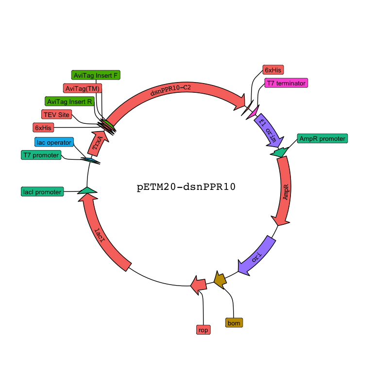
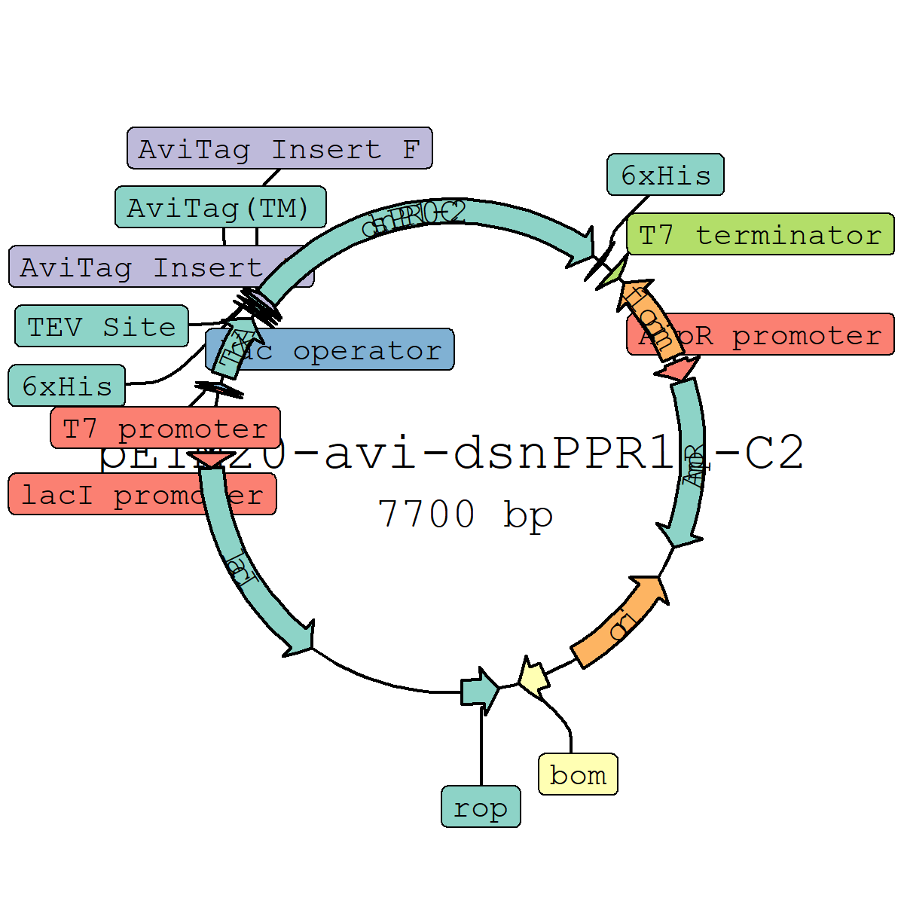

# plasmapR

This is an R package for making plasmid maps using `{ggplot2}`.

## Installation

> This package is still very early in development and the API may
> change. The parser for `.gb` files works most of the time but has not
> been tested extensively.

``` r
# install.packages("devtools")
devtools::install_github("bradyajohnston/plasmapr")
```

## Example

`plasmapR` provides functions for parsing and plotting .gb plasmid
files.

Once a plasmid has been exported in Genbank format it can be parsed and
plotted.

``` r
#devtools::install_github("bradyajohnston/plasmapR")
library(plasmapR)

plasmid <- parse_plasmid("data/petm20.gb")

p <- render_plasmap(plasmid,
                    rotation = 45,
                    plasmid_name = "pETM20-avi-dsnPPR10-C2")

p
```



## Under the Hood

The result of the `render_plasmid()` function is just a `ggplot` object,
so you can add themes and treat it as you would any other `ggplot`
object.

``` r
p <- p + ggplot2::scale_fill_brewer(palette = 8, type = "qual")

p
```

<!-- -->

Coordinates have been transformed with `coord_polar()` but everything
else remains the same.

``` r
p + 
  ggplot2::theme_dark() + 
  ggplot2::theme(legend.position = "top")
```


## Major Limitations

Currently the method for curving the text results in the problem of
resizing. The individual characters are spaced based on the underlying
base pair counts, not plot coordinates. If you scale the plot, things
start to break down pretty quickly.

I’m working on an fix that will allow resizing and scaling of the whole
plot, but currently defaults are set up for a plot width and height of 8
inches each.

``` r
knitr::opts_chunk$set(fig.width = 4, fig.height = 4)
```

``` r
p
```


