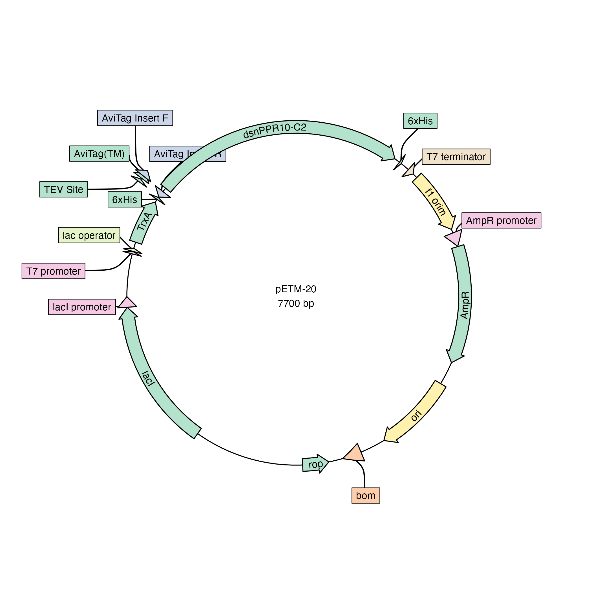
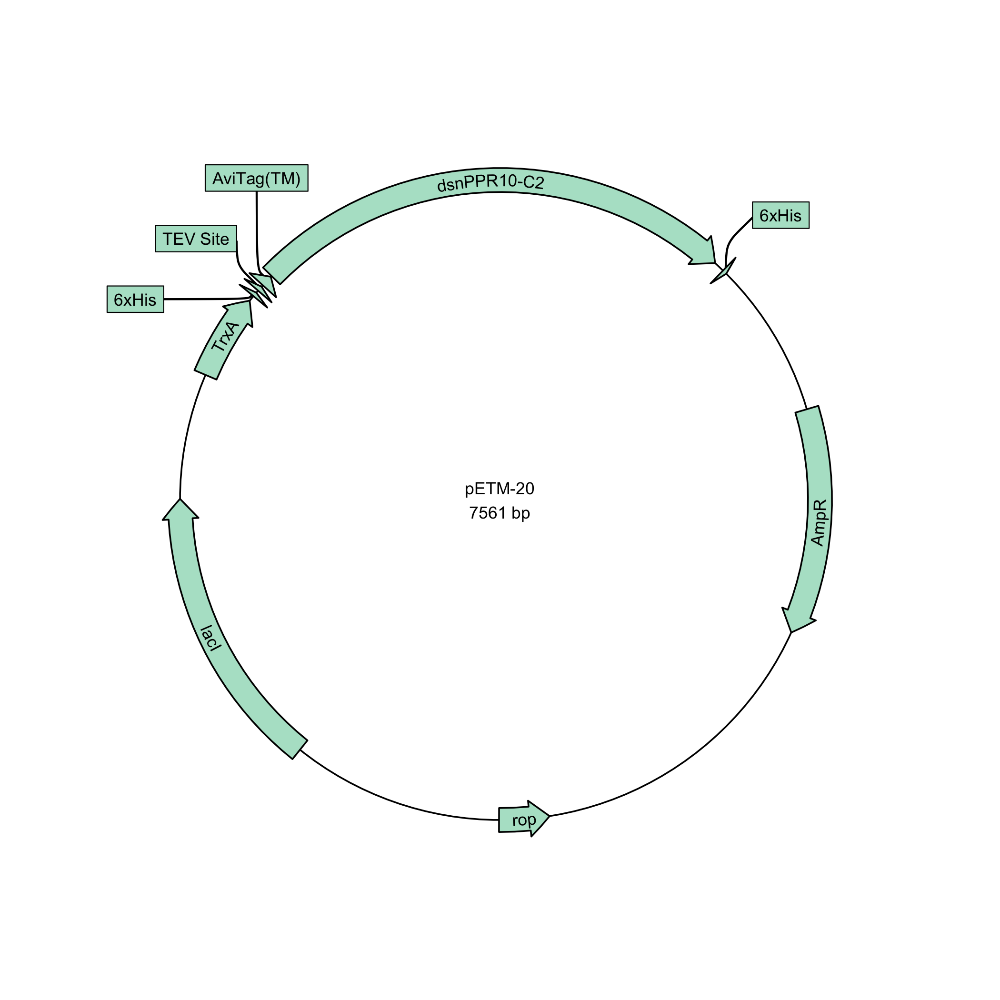
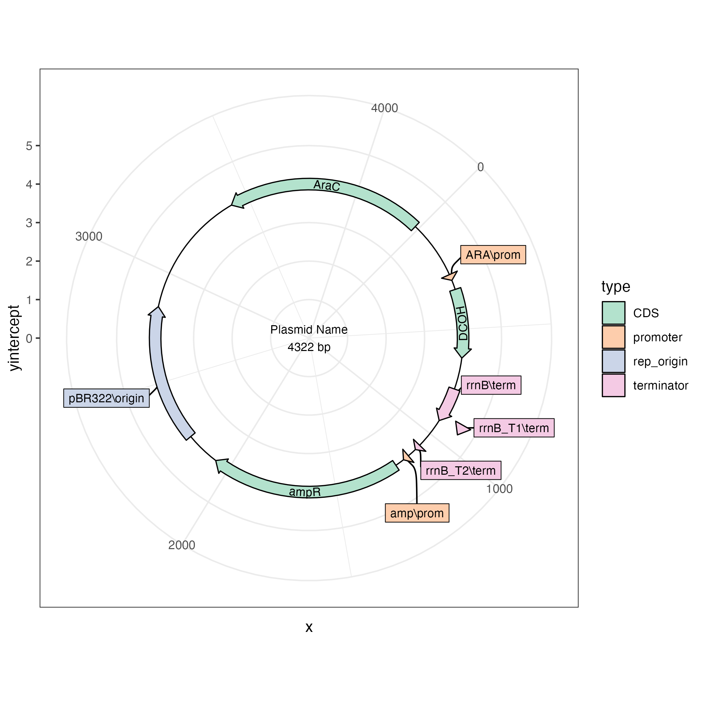

# plasmapR

<!-- badges: start -->

[](https://app.codecov.io/gh/bradyajohnston/plasmapR?branch=main)
[](https://github.com/bradyajohnston/plasmapR/actions/workflows/R-CMD-check.yaml)
<!-- badges: end -->

This is an R package for making plasmid maps using `{ggplot2}`.

## Installation

> This package is still very early in development and the API may
> change. The parser for `.gb` files works most of the time but has not
> been tested extensively.

``` r
# install.packages("devtools")
devtools::install_github("bradyajohnston/plasmapr")
```

## Example

`plasmapR` provides functions for parsing and plotting .gb plasmid
files.

Once a plasmid has been exported in Genbank format it can be parsed and
plotted.

``` r
library(plasmapR)

fl <- system.file('extdata', 'petm20.gb', package = "plasmapR")

fl |> 
  read_gb() |> 
  plot_plasmid(name = "pETM-20")
```

<!-- -->

Access the features by turning the plasmid into a data.frame.

``` r
fl <- system.file('extdata', 'petm20.gb', package = "plasmapR")

plasmid <- fl |> 
  read_gb()

dat <- plasmid |> 
  as.data.frame()

head(dat)
```

    ##   index                    name         type start  end direction
    ## 1     1 synthetic DNA construct       source     1 7700         1
    ## 2     2                 f1 orim   rep_origin    12  467         1
    ## 3     3           AmpR promoter     promoter   494  598         1
    ## 4     4                    AmpR          CDS   599 1459         1
    ## 5     5                     ori   rep_origin  1630 2218         1
    ## 6     6                     bom misc_feature  2404 2546         1

``` r
dat[dat$type == "CDS", ] |> 
  plot_plasmid(name = "pETM-20")
```

<!-- -->

It’s not currently intended for linear display, but it can be used as
such. I recommend checking out the
[`gggenes`](https://wilkox.org/gggenes/) package.

``` r
dat[dat$type == "CDS", ] |> 
  plot_plasmid(name = NULL) + 
  ggplot2::coord_cartesian() + 
  ggplot2::scale_y_continuous(limits = NULL)
```

<!-- -->

## A {ggplot2} Object

The result of the call is just a {ggplot2} plot, which you can further
customise to your liking with themes, etc.

``` r
fl <- system.file('extdata', '20.gb', package = "plasmapR")

plt <- fl |> 
  read_gb() |> 
  plot_plasmid()

plt + ggplot2::theme_bw()
```

<!-- -->
